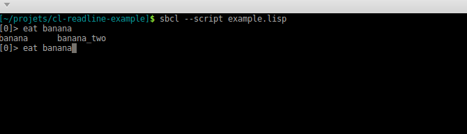

## Readline example in Common Lisp

Example from cl-readline's documentation: https://vindarel.github.io/cl-readline/

Showcases custom completion and keybindings.

Run the example from the doc:

    sbcl --script example.lisp

or preferably build an executable:

    make build  # and then ./clreadline

(we added handling of a `C-c`).

See the `custom completion`: first, type and complete a verb (eat, throw,…). Later words are completed as fruits (orange, banana,…). Type "o<TAB>" and see the completion to "orange" (no dropdown list).

Also type `C-o` to insert custom text.

A command line app using cl-readline:

* [cl-repl](https://github.com/koji-kojiro/cl-repl) - an SBCL repl.
* [shtookovina](https://github.com/mrkkrp/shtookovina/) (unmaintained)

## Changelog

We added:

* asdf system declaration
* `make build` to build a binary
* catch a `C-c` (and others) and quit gracefully (in executable only).
